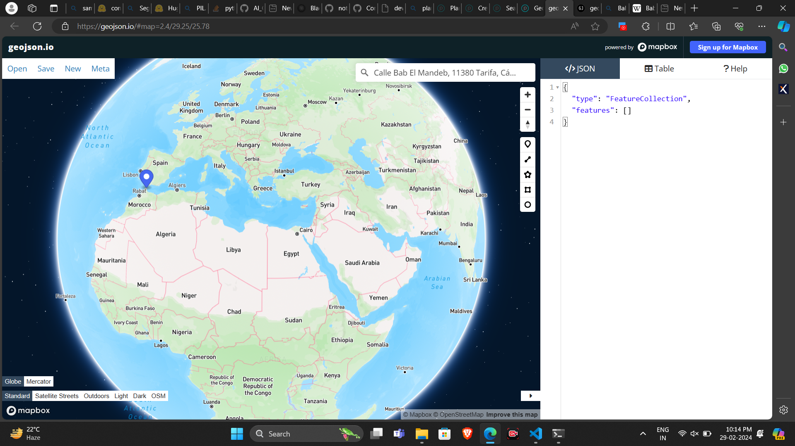

You are given with a query and some comma separated object classes. You have to identify the potential classes out of object classes that exist in the given query.
The response should be strictly formatted in following json schema:
```json
{
  "$schema": "http://json-schema.org/draft-07/schema#",
  "type": "object",
  "properties": {
    "class": {
      "type": "array",
      "items": {
        "type": "string"
      },
      "uniqueItems": true
    }
  },
  "required": ["class"]
}
```
For example:
query: "How many vehicles are there in New York Highway?"
object_classes: "car", "building", "people", "bicycle", "trees", "bus"

Response should be:
```json
{{"class": ["car", "bus", "bicycle"]}}
```


Using above example, generate response for this:


query: "How many ships are there on bab e mandab on 13 feb 2023 ?"
object_classes: "boat", "person"

Give me formatted json for the potential classes:


https://developers.planet.com/docs/planetschool/geojson-and-areas-of-interest-aois/